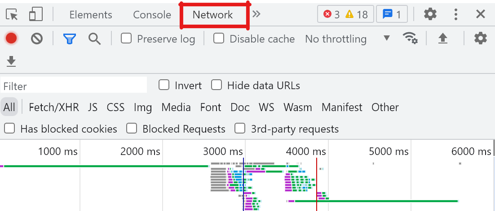
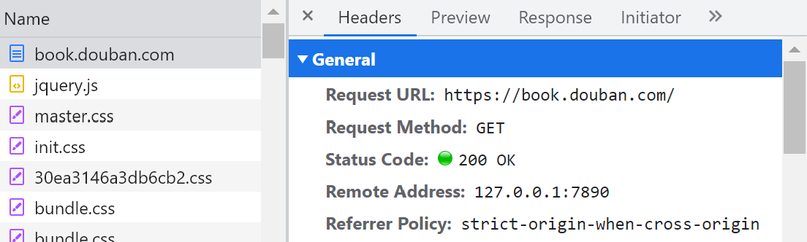

# Notion Transfer
[](https://github.com/lccurious/notion-transfer/actions/workflows/notion-douban-sync.yml)

## Installation

```shell
git clone git@github.com:lccurious/notion-transfer.git
cd notion-transfer
pip install -r requirements.txt
```

## Usage

1. 创建本地环境文件 `.env`:
   ```shell
   NOTION_TOKEN=
   BASE_PAGE_ID=
   BOOK_DATABASE_ID=
   MOVIE_DATABASE_ID=
   DOUBAN_COOKIE=
   DOUBAN_CK=
   USER_AGENT=
   UID=
   ```
   - 其中，`NOTION_TOKEN` 需要你在 <https://www.notion.so/my-integrations> 创建一个，并将获取的TOKEN补全在这个 `.env` 文件中，更具体的步骤可以参考: <https://developers.notion.com/docs/create-a-notion-integration>
   
   
   - `BASE_PAGE_ID` 是你要插入这些数据库的页面ID。在Notion中打开页面。 使用共享菜单复制链接。 现在将链接粘贴到您的文本编辑器中，以便您可以仔细查看。 URL 以页面 ID 结尾。它应该是一个 32 个字符长的字符串。 通过在以下模式中插入连字符 (-) 来格式化此值：8-4-4-4-12（每个数字是连字符之间的字符长度）。
   示例：`1429989fe8ac4effbc8f57f56486db54` 变为 `1429989f-e8ac-4eff-bc8f-57f56486db54`。
   该值是您的页面 ID。将这个ID填写到`BASE_PAGE_ID`后。
   在集成可以在另一个页面中创建一个页面之前，它需要访问页面父级。 要与集成共享页面，请单击页面右上角的`•••`菜单，滚动到添加连接，然后使用搜索栏从下拉列表中查找并选择集成。

   - `BOOK_DATABASE_ID` 和 `MOVIE_DATABASE_ID` 按照第一次运行的输出进行更新。

   - `DOUBAN_COOKIE` 填写登录过豆瓣以后获得的cookie，打开F12
     
     
   
   - `DOUBAN_CK` 从Cookie中寻找对应字段
     
   - `USER_AGENT` 从header中寻找对应字段   

   - `UID` 你的豆瓣ID：<https://www.douban.com/people/UID>


2. 第一次使用需要先创建数据库
   ```shell
   python sync_douban.py --init
   ```

3. 开始执行同步
   ```shell
   python sync_douban.py --sync
   ```

   第一次同步时间取决于用户的豆瓣标记数据量，为了减少对豆瓣服务器的影响，每次请求之后都会增加随机时延。

4. 设置定期更新数据操作（如果有机器一直开着的话）
   ```shell
   SHELL=/bin/bash
   PATH=/usr/bin:/bin:/home/ubuntu/miniconda3/bin
   # 每天凌晨4:30执行豆瓣数据库核对
   # 分 时 日 月 周
   30 4 * * * source activate notion; cd /home/ubuntu/app/notion-transfer && python sync_douban.py --sync; source deactive
   ```
